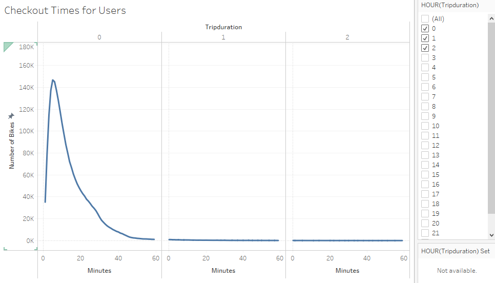
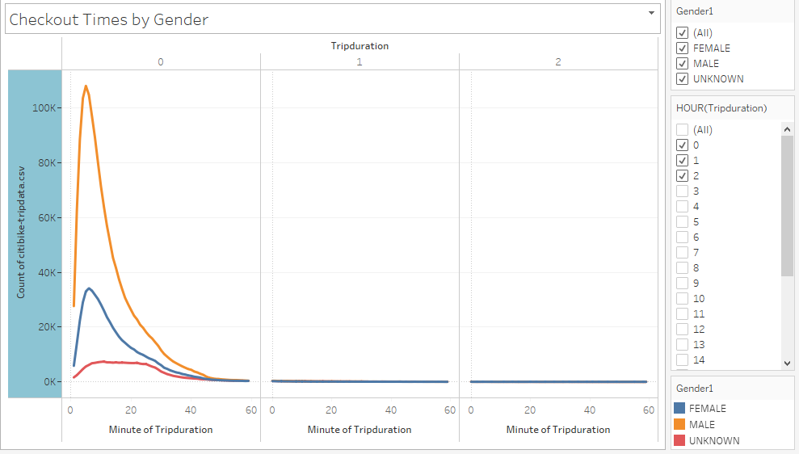
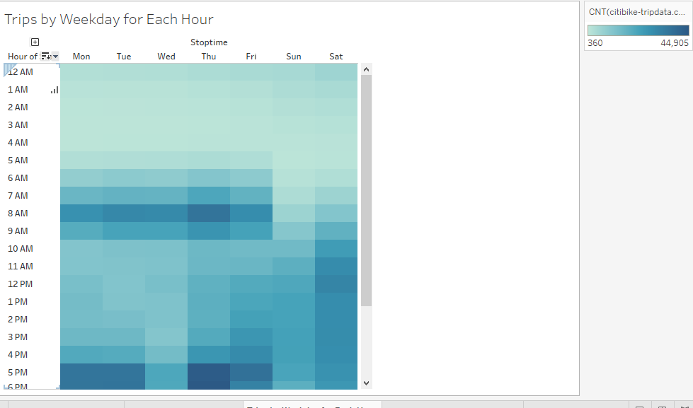
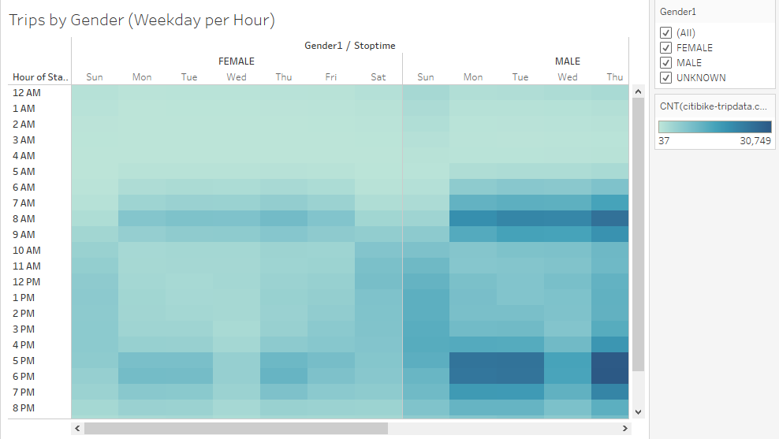
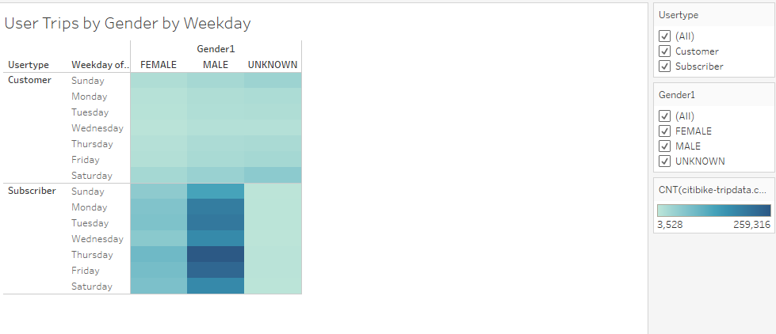
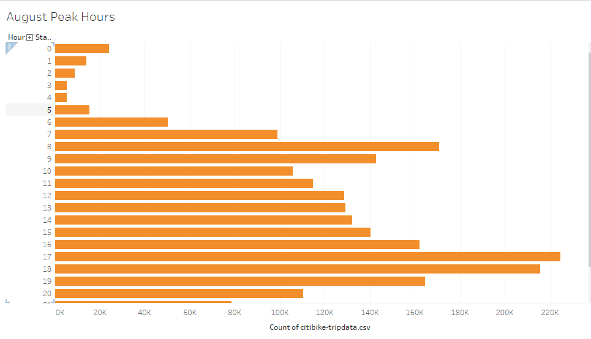
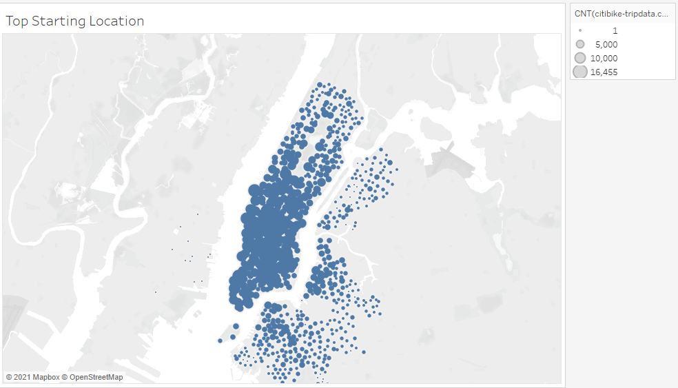

# Overview of Project

This project is about creating a proposal for a bike-share business in Des Moines, similar to the one in New York city.  

The first step is to figure out how the bike-share business actually work in New York. From there a proposal as to how it might work 
in Des Moines can be created for the investers. The proposal will be based on the visualizations being prepared through Tableau and the
data used is the Citi Bike data that has been released to public.

# Results

## 1. 

### **Checkout Times for Users:**

In the above visualization, it's shown that how long the bikes are checked out for all the riders

## 2.

### **Checkout Times by Gender:**

The above visualization displays how long the bikes were checked out by different genders

## 3. 

### **Trips by Weekday for Each Hour:**

The visualization of the total trips taken by the hour for each day of the week, for all riders

## 4.

### **Trips by Gender(Weekday per Hour):**

The visualization of the total trips taken by the hour for each day of the week, by all the genders

## 5. 

### **User Trips by Gender by Weekday:**

The visualization

## 6.

### **August Peek Hours:**

The visualization is for the peak riding hours in August.

## 7.

### **Top Starting Locations:**

The visualization is to find the most popular stations in the city for starting a bike journey.

## Summary

In this project, a proposal is to be prepared to start a bike-share business in Des Moines. The data used is of the Citi Bike business in 
the New York city. Various graphs and a dashborad/story has been created to display as to how the business works.

Two additional visualizations suggested for future analysis can be:
- Number of trips taken in other months
- Find the number of rides by the age group

## The Dashboard Link

[Link to the dashborad](https://public.tableau.com/app/profile/jeesha3171/viz/NYCCitibikeAnalysis_16284241543180/NYCCitibikeAnalysis?publish=yes)