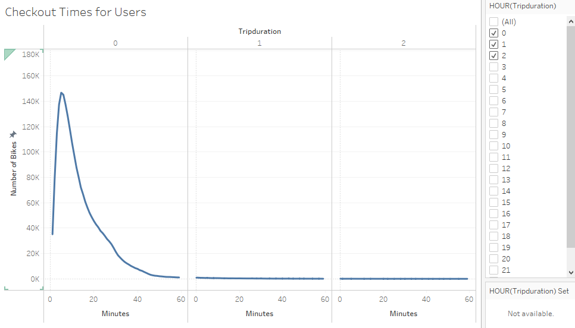
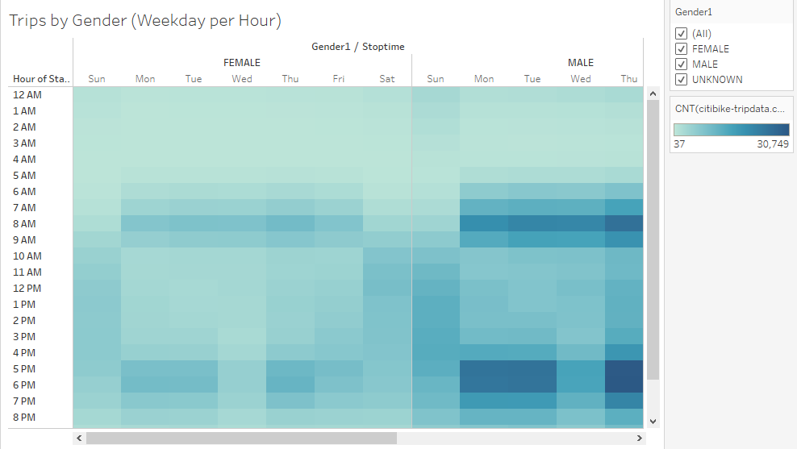

# Overview of Project: 

# Results
1. 

## Checkout Times for Users

In the above visualization, it's shown that how long the bikes are checked out for all the riders

2. 

## Checkout Times by Genders

The above visualization displays how long the bikes were checked out by different genders

3. 

## Trips by Weekday for Each Hour

How many trips are taken by the hour for each day of the week, for all riders

4. 

## Trips by Gender(Weekday per Hour)

How many trips are taken by the hour for each day of the week, by all the genders

5. 

## A breakdown of what days of the week a user might be more likely to check out a bike, by type of user and gender.

6. 

## August Peek Hours

7. 

## Top Starting Locations